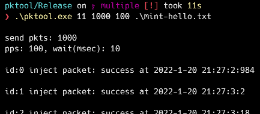

# pktool

`pktool` just sends a packet what you want.

> No matter broadcast, multicast, pseudo protocol, jumbo frame even not own source MAC Address. pktool sends it (best effort).

pktool can configure Layer 2 Ethernet frame.

## Dependencies

winpcap, win10pcap or npcap(WinPcap compatible mode) is needed. But if you can run Wireshark, no issue to use `pktool`. Because of while installing Wireshark, the lib should be installed.

If not installed Wireshark, please install **npcap**: https://nmap.org/download.html (recommended) and select "WinPcap API-compatible mode" at installation.

- winpcap: https://www.winpcap.org/install/
- win10pcap: http://www.win10pcap.org/download/

## Quick run

The packet is generated and sent by two ways:

- Run `pktool.exe`  and interactively set network interface, destination MAC Address, protocol. Then it goes to a network.

  MAC source is 12:34:56:78:9a:bc (fixed default)

  

- Run `pktool.exe` `<network interface index>` `<Hex stream txt file>` then it goes to a network.

  At figure set interface index is 9 thus uses Realtek USB GbE... for sending the packet
  
  

## network interface index

This is an index of network interface. Sometime it changes by doing reboot/delete interface/etc.

Run `pktool.exe` shows it at left as 1., 2., 3., .....

## Hex stream txt file

This is hex stream packet data which can be generated by hand type if you know about packet. Of course there is alternative way by utilizing Wireshark.

E.g. dump.txt

```
b0ffc200000ebeecf20271aa88cc020704b87cf20271a80406053432efd2f32060200780a0e416c696c61322d535223ef4cc50fe0c00120f020bdfe43200000fe09001234010300010000fe070012bb010023eaa000
```

`pktool` can configure Layer 2 Ethernet frame. Thus, first 48 bytes is MAC destination. Next is MAC source, then EtherType(protocol)...

- MAC destination is `b0:ff:c2:00:00:0e`
- MAC source is         `be:ec:f2:02:71:aa`
- A protocol is            `88cc` is LLDP      

....

Here is about EtherType(protocol): https://en.wikipedia.org/wiki/EtherType

Here is about 802.1Q - VLAN: https://en.wikipedia.org/wiki/EtherType worth reading. And can try.

### Easy way to create the hex stream txt by Wireshark

- Run Wireshark and start a packet capture or open desired .pcap file.
- Right click a packet which you want to send again or customize then Copy as Hex Stream


and paste it to notepad etc. It would be:

```
ffffffffffff98e743f3ff8e0806000108000604000198e743f3ff8e0a0a64630000000000000a0a64fe
```

### Modify the packet

Let's open the packet by double click it(E.g. the no.49 packet on the above figure).

Then click the `Source: Dell_f3:ff:8e...` . Now can see which HEX data are for the source MAC Address at lower HEX dump panel and it highlighted `98 e7 43 f3 ff 8e`


Let's modify the source MAC Address to ca:fe:00:00:00:00


ctrl+h then Find what: `98e743f3ff8e`, Replace with: `cafe00000000` and Replace MAC destination. (tick Wrap around) . 

Result is: save it to arp.txt file.

```
ffffffffffffcafe0000000008060001080006040001cafe000000000a0a64630000000000000a0a64fe
```

Let's send it.


Observed it on Realtek USB GbE(index 9) with Wireshark. At Wireshark the interface name is Ethernet2(depend on PC). You can find it by ipconfig etc.


Before modify MAC source is Dell machine, but now ca:fe:00...  

## Appendix

pcap catalog: https://packetlife.net/captures/

Download it, open it with Wireshark, modify it then send it by `pktool.exe`


